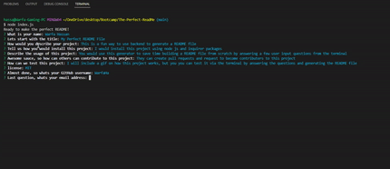

# My Perfect README File

## Table of Contents
* [Description](#description)
* [Installation](#installation)
* [Usage](#usage)
* [Contribution](#contribution)
* [Tests](#test)
* [Licenses](#licenses)
* [Contact](#contact)
* [Credits](#credits)
## Description
This is a fun way to use backend to generate a README file
## Installation
I would install this project using node js and inquirer packages
## Usage
You would use this generator to save time building a README file from scratch by answering a few user input questions from the terminal
## Contribution
They can create pull requests and request to become contributers to this project
## Tests
I will include a gif on how this project works, but you you can test it via the terminal by answering the questions and generating the README file

## Licenses
     To view the MIT license. Click the license button above.
## Contact
If you have any additional questions, here's how to reach me.

GitHub: https://github.com/WarfaHa  
Email: Warfa60@gmail.com

## Credits
This README file was created by Warfa Hassan
